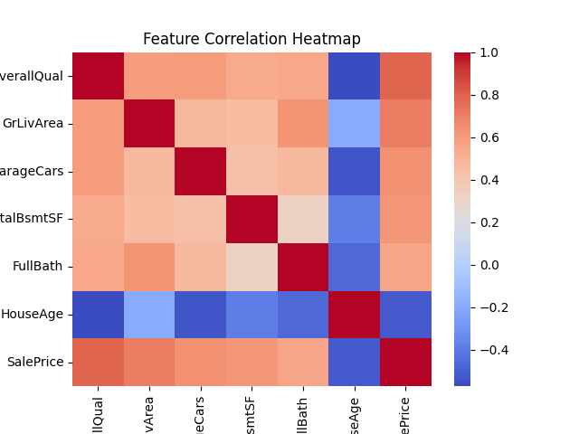
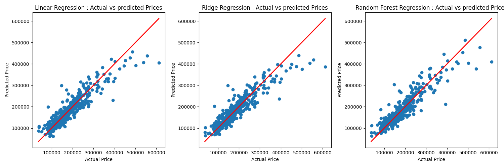

# 🏠 House Price Prediction using Machine Learning

An end-to-end Machine Learning project that predicts house prices using Linear Regression, Ridge Regression, and Random Forest — with feature engineering, polynomial features, and model comparison.

---

## 📌 Overview

This project builds a complete ML pipeline to predict house prices based on features like area, bedrooms, bathrooms, floors, and house age.

It includes data preprocessing, feature engineering, model training, evaluation using MSE, and visualization using graphs — structured in a clean and beginner-friendly way.

---

## 🚀 Features

✅ Data loading and exploration
✅ Feature Engineering:

* YearBuilt → house_age

✅ Correlation Heatmap (EDA)
✅ Polynomial Features (degree = 2)
✅ Feature Scaling using StandardScaler
✅ Model training:

* Linear Regression
* Ridge Regression ✅ (Best Model)
* Random Forest Regression

✅ Model evaluation using MSE
✅ Automatic best model selection
✅ Actual vs Predicted visualization
✅ Model saving using Joblib
✅ User input-based prediction system

---

## 🧠 Tech Stack

| Tool         | Purpose                   |
| ------------ | ------------------------- |
| Python       | Core language             |
| Pandas       | Data manipulation         |
| NumPy        | Numerical operations      |
| Scikit-learn | ML models & preprocessing |
| Matplotlib   | Graph plotting            |
| Seaborn      | Heatmap visualization     |
| Joblib       | Model saving/loading      |

---

## 📂 Project Structure

```
House-Price-Prediction/
│
├── data/
│   └── data.csv
│
├── src/
│   ├── train.py
│   └── predict.py
│
├── model.pkl
├── scaler.pkl
├── poly.pkl
│
├── images/
│   ├── heatmap.png
│   └── prediction_graph.png
│
├── requirements.txt
└── README.md
```

---

## ⚙️ How It Works

Raw Data → Feature Engineering → Encoding → Polynomial Features → Scaling → Train → Evaluate → Predict

1. Load dataset
2. Drop unnecessary column (`Id`)
3. Create new feature → `house_age`
4. Apply One-Hot Encoding for categorical data
5. Apply Polynomial Features (degree = 2)
6. Scale features using StandardScaler
7. Train 3 models
8. Compare using MSE
9. Select best model automatically
10. Save model, scaler, and transformer

---

## 📊 Model Performance

| Model             | MSE        |
| ----------------- | ---------- |
| Linear Regression | 8.38e+10   |
| Ridge Regression  | 8.15e+10 ✅ |
| Random Forest     | 8.65e+10   |

👉 Ridge Regression performed best with lowest MSE.

---

## 📈 Visualizations

### 🔹 Correlation Heatmap

Shows relationship between features.



---

### 🔹 Actual vs Predicted

Closer points to diagonal line = better predictions.



---

## ▶️ How to Run

### 1. Install dependencies

```
pip install -r requirements.txt
```

### 2. Train model

```
python src/train.py
```

### 3. Run prediction

```
python src/predict.py
```

---

## 💡 Key Insights

* Polynomial features increased model complexity
* Ridge Regression reduced overfitting using regularization
* Linear Regression struggled with higher complexity
* Random Forest did not outperform Ridge for this dataset

---

## 🔮 Future Improvements

* Hyperparameter tuning for Ridge
* Try XGBoost / Gradient Boosting
* Build Streamlit web app
* Deploy project online

---

## 👨‍💻 Author

Parth Shelar

---

## ⭐ If you found this useful
Give it a star ⭐ on GitHub!


